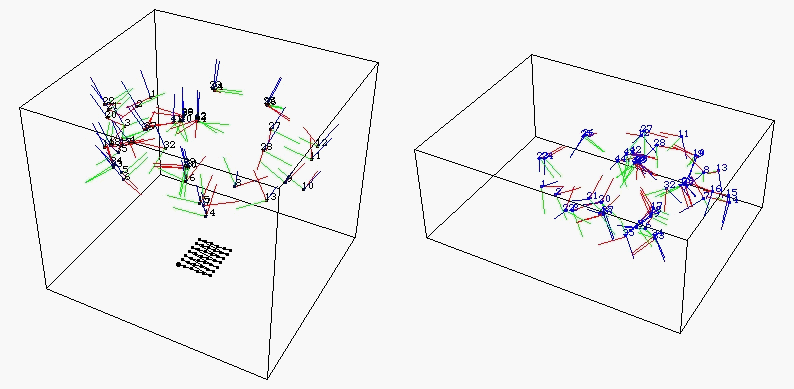
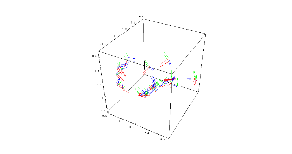

# Ground Truth Pose Estimation

A tutorial repository to generate ground truth pose for markers, objects and robots.

## Marker Pose Estimation

  

### Resources
- Aligning rigid body pivot point with a replicated 3D Model [[website]](https://docs.optitrack.com/motive/rigid-body-tracking/aligning-rigid-body-pivot-point-with-a-replicated-3d-model)
- Rigid Body Animation [[code]](https://aaronolsen.github.io/tutorials/motion/unification.html)
- Mocap Calibration Research [[code]](https://github.com/SamDSchofield/mocap_calibration_research) [[paper]](https://ieeexplore.ieee.org/stamp/stamp.jsp?tp=&arnumber=6385773) 

## Robot Pose Estimation

  

### Resources
- Mocap Calibration Research [[code]](https://github.com/SamDSchofield/mocap_calibration_research) [[paper]](https://ieeexplore.ieee.org/stamp/stamp.jsp?tp=&arnumber=6385773) 

## Object Pose Estimation
### Rigid Object Pose Estimation

#### Resources

### Articulated Object Pose Estimation

    
    
    

    
    
    

#### Resources
- EasyMocap [[code]](https://github.com/zju3dv/EasyMocap) [[paper]]() [[video]]()
- Human Motion Capture [[code]](https://github.com/visonpon/human-motion-capture) [[paper]]() [[video]]()
- FrankMocap [[code]](https://github.com/facebookresearch/frankmocap) [[paper]]() [[video]]() 
- Awesome Human Pose Estimation [[code]](https://github.com/wangzheallen/awesome-human-pose-estimation) [[paper]]() [[video]]()
- SnowMocap [[code]](https://github.com/liaochikon/SnowMocap) [[paper]]() [[video]]() 

## Manipulator to Camera Pose Estimation

  
  

  
  

  
  

  
  

### Resources
- Hand Eye Calibration [[website]](https://campar.in.tum.de/Chair/HandEyeCalibration)
- Eye in Hand Toolbox [[code]](https://github.com/liaochikon/Eye-in-hand-toolbox)
